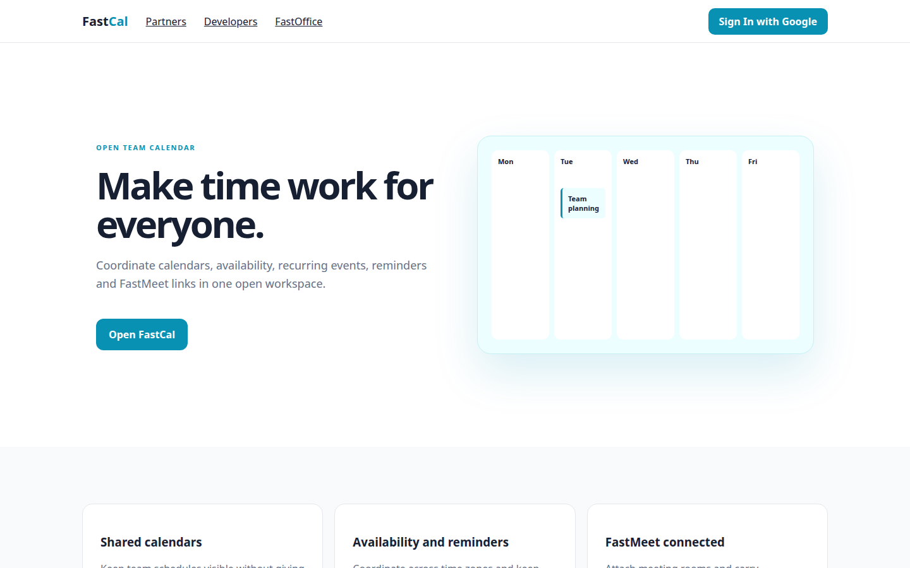
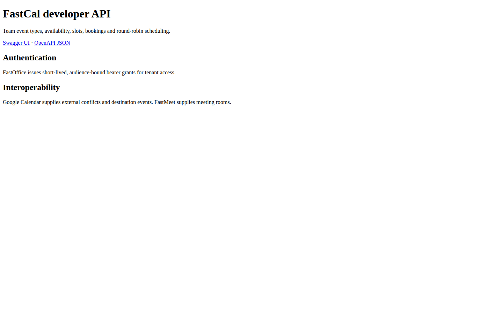

# FastCal Platform Guide

**Published:** 2026-08-19
**Platform:** [https://cal.fastsme.com](https://cal.fastsme.com)
**Source:** [github.com/predictivelabsai/FastCal](https://github.com/predictivelabsai/FastCal)

## Platform overview

FastCal is the open, tenant-native team calendar in the FastOffice suite. It provides individual, collective, and weighted round-robin event types, timezone-safe availability, Google Calendar conflict prevention, FastMeet rooms, public booking links, cancellation, notifications, and a versioned API.

This visual guide was reviewed against the live product using Playwright. Screens and available navigation can vary by account, role, and deployment configuration.

## 1. Make time work for everyone.

OPEN TEAM CALENDAR Make time work for everyone. Coordinate calendars, availability, recurring events, reminders and FastMeet links in one open workspace. Open FastCal Mon Tue Team planning Wed Thu Fri Shared calendars Keep team schedules visible without giving

Screen reviewed at: [https://cal.fastsme.com/](https://cal.fastsme.com/)

## 2. Sign in

Sign in with Google Sign in to continue to fastsme.com Email or phone Forgot email? Next Create account Afrikaans azərbaycan bosanski català Čeština Cymraeg Dansk Deutsch eesti English (United Kingdom) English (United States) Español (España) Español (Latinoam

Screen reviewed at: [https://accounts.google.com/v3/signin/identifier?opparams=%253F&dsh=S1596677780%3A1787122651061383&access_type=offline&client_id=887059023987-2a7spj1m82eivobdbt1itb3cqca6tpt1.apps.googleusercontent.com&include_granted_scopes=true&o2v=2&prompt=consent+select_account&redirect_uri=https%3A%2F%2Fcal.fastsme.com%2Fauth%2Fgoogle%2Fcallback&response_type=code&scope=openid+email+profile+https%3A%2F%2Fwww.googleapis.com%2Fauth%2Fcalendar&service=lso&state=2dSgsMRSHV6GWvtRpV0jlzEds_cmnOtnReGPM91WP3M&flowName=GeneralOAuthLite&continue=https%3A%2F%2Faccounts.google.com%2Fsignin%2Foauth%2Flegacy%2Fconsent%3Fauthuser%3Dunknown%26part%3DAJi8hAM91P28t2r8gqjTdx98-RKWIjBvybf7Kjhi_yfYmLBy5ujZiNgEqUapkw-3lXfaVHZUyOA4_fHNzq_5J6eYw9ktanqZRjqRXk3tTF251QlolEVGJymc-phIbl1T36xRGwDnRJz3iz-jo7Hg5VD2953i4dOIpiWAHlVR99fBtSSdLXn0WnmxPIbycwhfW2fNkmInwDdRFyz3AwTgVb4wvFzL1qWXgDRT7YQySZ0TjIEpV9gbgnPAELkOefn_8DVZr0qvlX_QjGx_1kUYDQOgDQycDCFfFRNzt2TCS_iWVDFeqT6sOiDykAlmzCcv0pRkxh3VGc6fJ_GL45IrPKKI3pQ7bOJbRH6oqOd_FHcERE05NHGaSnzhgi6k1HTyXhzKarg23XcFVfeeiCQfPqir1X1t4yCdqaDsQa-b3_tDSPb2bbHMY9s8F63dKKSB3E5_7iWPQmxxYh2D3xZpxHxw0X7tNhuhnmHpMXnWVBPZO51qaA-r82M%26flowName%3DGeneralOAuthFlow%26as%3DS1596677780%253A1787122651061383%26client_id%3D887059023987-2a7spj1m82eivobdbt1itb3cqca6tpt1.apps.googleusercontent.com%23&app_domain=https%3A%2F%2Fcal.fastsme.com&rart=ANgoxcd0q6daE19FzFSs0vceVbohNyrVEzVVIC5Zz2EuwoH23adLILSHasACdQDHulJlazz5OzteOw5EsLG-ordtIuVGOjbE8IR1f4GmDtqbFFWaYHUXNuM](https://accounts.google.com/v3/signin/identifier?opparams=%253F&dsh=S1596677780%3A1787122651061383&access_type=offline&client_id=887059023987-2a7spj1m82eivobdbt1itb3cqca6tpt1.apps.googleusercontent.com&include_granted_scopes=true&o2v=2&prompt=consent+select_account&redirect_uri=https%3A%2F%2Fcal.fastsme.com%2Fauth%2Fgoogle%2Fcallback&response_type=code&scope=openid+email+profile+https%3A%2F%2Fwww.googleapis.com%2Fauth%2Fcalendar&service=lso&state=2dSgsMRSHV6GWvtRpV0jlzEds_cmnOtnReGPM91WP3M&flowName=GeneralOAuthLite&continue=https%3A%2F%2Faccounts.google.com%2Fsignin%2Foauth%2Flegacy%2Fconsent%3Fauthuser%3Dunknown%26part%3DAJi8hAM91P28t2r8gqjTdx98-RKWIjBvybf7Kjhi_yfYmLBy5ujZiNgEqUapkw-3lXfaVHZUyOA4_fHNzq_5J6eYw9ktanqZRjqRXk3tTF251QlolEVGJymc-phIbl1T36xRGwDnRJz3iz-jo7Hg5VD2953i4dOIpiWAHlVR99fBtSSdLXn0WnmxPIbycwhfW2fNkmInwDdRFyz3AwTgVb4wvFzL1qWXgDRT7YQySZ0TjIEpV9gbgnPAELkOefn_8DVZr0qvlX_QjGx_1kUYDQOgDQycDCFfFRNzt2TCS_iWVDFeqT6sOiDykAlmzCcv0pRkxh3VGc6fJ_GL45IrPKKI3pQ7bOJbRH6oqOd_FHcERE05NHGaSnzhgi6k1HTyXhzKarg23XcFVfeeiCQfPqir1X1t4yCdqaDsQa-b3_tDSPb2bbHMY9s8F63dKKSB3E5_7iWPQmxxYh2D3xZpxHxw0X7tNhuhnmHpMXnWVBPZO51qaA-r82M%26flowName%3DGeneralOAuthFlow%26as%3DS1596677780%253A1787122651061383%26client_id%3D887059023987-2a7spj1m82eivobdbt1itb3cqca6tpt1.apps.googleusercontent.com%23&app_domain=https%3A%2F%2Fcal.fastsme.com&rart=ANgoxcd0q6daE19FzFSs0vceVbohNyrVEzVVIC5Zz2EuwoH23adLILSHasACdQDHulJlazz5OzteOw5EsLG-ordtIuVGOjbE8IR1f4GmDtqbFFWaYHUXNuM)

## 3. FastCal developer API

FastCal developer API Team event types, availability, slots, bookings and round-robin scheduling. Swagger UI · OpenAPI JSON Authentication FastOffice issues short-lived, audience-bound bearer grants for tenant access. Interoperability Google Calendar supplies

Screen reviewed at: [https://cal.fastsme.com/developers](https://cal.fastsme.com/developers)

## 4. Welcome to your work.

← Back F FastOffice ONE CONNECTED WORKSPACE Welcome to your work. Sign in once to open every FastOffice product. D S P ✦ Sign in to FastOffice Use your email and password or continue with Google. Continue with Google or Email Password Forgot password? Sign in

Screen reviewed at: [https://office.fastsme.com/login?next=/launch/calendar](https://office.fastsme.com/login?next=/launch/calendar)

## Getting started

Visit [https://cal.fastsme.com](https://cal.fastsme.com) to explore FastCal. For source code and deployment details, use the GitHub link above.
